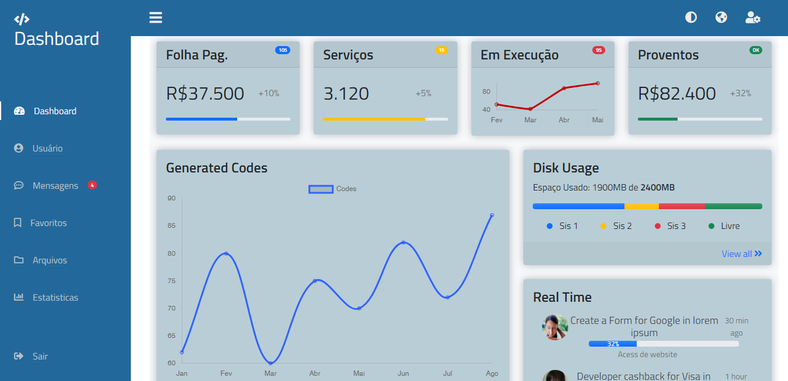

<h1>:heavy_check_mark: Simple Frontend Dashboard com Framework Bootstrap.</h1>

<h2 align="center">💻 Sobre o projeto</h2>

:wave: - Projeto frontend desenvolvido para criação de uma dashboard com o framework Bootstrap 5.
 

<b>:clock12: - Duração do Projeto: 45 horas divididas em 6 dias.</b>

<h2 align="center">Foi usado:</h2>

 
 

